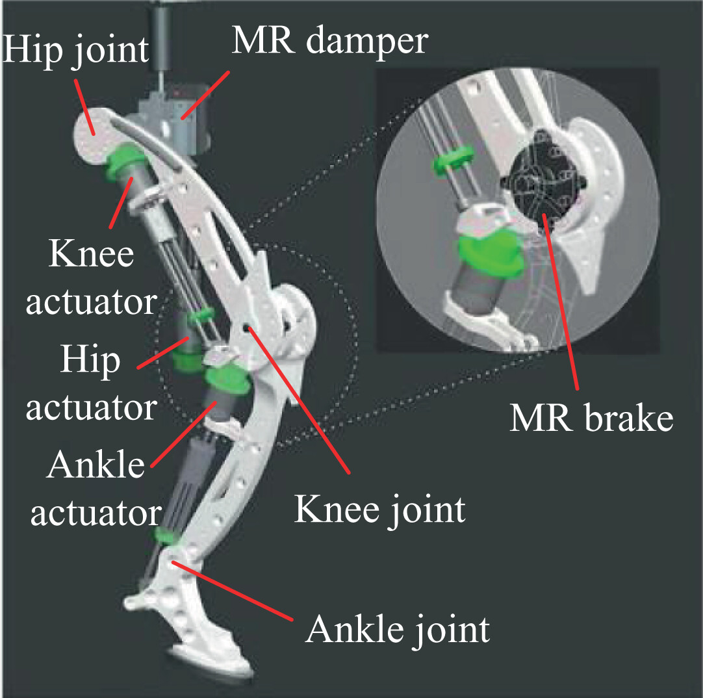

# 🎯 *Design a leg for the Spot robot using a 3R planar mechanism*

You are expected to:

1. 🦿 **Model the leg as a 3R planar mechanism**, meaning:

   * It has **3 revolute (rotating) joints**
   * Operates in a **2D plane** (usually the XZ plane)
   * Mimics the structure of robotic legs like **Spot** or **HADE**

2. 🛠️ **Implement one or more of the following**:

   * 📐 **Kinematics** (Forward / Inverse)
   * ⚙️ **Transmission System**
   * 🧰 **Structural Design** (CAD in Fusion 360)

> ✅ You may complete one or multiple parts — more than one is appreciated.

---

## 🧠 Concept Inspiration

While researching **3R planar leg mechanisms**, I came across the design of **Redundant Articulated Legs** used in advanced quadrupeds. A key inspiration was the **HADE (Hybrid Actuator Development) Leg**, which replicates the motion of a horse leg.

  
  

The HADE-inspired structure includes:

* 🦴 **Thigh**, **Shank**, and **Foot**
* 🔁 **Hip**, **Knee**, and **Ankle** joints
* ✅ Forms a 3R planar chain ideal for high **payload-to-weight ratio**

---

## 🛠️ Structural Design — 3R Planar Leg

Based on the HADE mechanism, I designed a **3R Planar Robotic Leg** in **Fusion 360**, consisting of:

* **Links**: Thigh → Shank → Foot
* **Joints**: Hip (R1) → Knee (R2) → Ankle (R3)

The structure operates in the **XZ plane** — ideal for vertical locomotion and control testing.

---

### 📐 Leg Dimensions (Fusion 360 Model)

| Segment | Label | Length (mm) |
| ------- | ----- | ----------- |
| Thigh   | L1    | 453.018     |
| Shank   | L2    | 453.056     |
| Foot    | L3    | 188.056     |

---

### 📷 CAD Design Output

  
  
  

> *Figure: Isometric, Front, and Back Views of 3R Planar Leg*

---

### 🎥 Interactive 3D View (Fusion 360)

[🔗 Click here to view the model in 3D](https://a360.co/3IevnWv)

---

## ⚙️ Transmission System

We designed a HADE-inspired transmission system to drive the 3R leg in real-world builds.

---

### 🦿 HADE Leg

  
  

> *Left: HADE Prototype Actuation; Right: Our Fusion 3R Leg Animation*

---

### 🔩 Transmission Configuration

| Joint | Type                    | Method                                              |
| ----- | ----------------------- | --------------------------------------------------- |
| Hip   | Active                  | SEA (Series Elastic Actuator) + Spring + Encoder    |
| Knee  | Active                  | SEA + Encoder                                       |
| Ankle | Passive (Underactuated) | Extension Spring (`Ks = 3113 N/m`) + Linear Encoder |

---

### 📊 HADE Control System Details

* 🌀 **SEAs at Hip & Knee**

  * Spring + encoder setup for force sensing (1.2 N/count)
  * Position resolution: 50.8 µm/count
* 🦶 **Passive Ankle**

  * Extension spring (torque sensing: 0.69 N/count)
  * Linear encoder resolution: 224 µm/count
* 🧠 **PID-based inverse kinematics control**

  * Uses joint encoders + spring deflection
  * Ground contact detected via ankle torque

---

### 💡 What We Learn

* SEAs provide **compliance**, force feedback, and safety
* Passive joints reduce **power consumption**
* High-res encoders support **precise feedback control**
* This method is ideal for robots on **variable terrain**

---

## 📐 Kinematics of a 3R Planar Robotic Leg (Fusion 360 Model)

## 1. Forward Kinematics

### 🎯 Goal:

To find the foot position (x, z) based on the current angles of the hip, knee, and ankle motors.

### 📥 Inputs:

* theta1: Hip joint angle (in degrees or radians)
* theta2: Knee joint angle (relative to thigh)
* theta3: Ankle joint angle (relative to shin)

### 🧠 Logic:

The robot leg has 3 links connected in series.

1. First link (thigh) rotates by theta1
2. Second link (shin) rotates by theta2 **relative to the thigh**
3. Third link (foot) rotates by theta3 **relative to the shin**

### 🪜 Steps:

1. Add up the angles cumulatively:

   * a1 = theta1
   * a2 = theta1 + theta2
   * a3 = theta1 + theta2 + theta3

2. For each link, calculate its (x, z) contribution:

   * Link 1: (x1, z1) = (L1 * cos(a1), L1 * sin(a1))
   * Link 2: (x2, z2) = (L2 * cos(a2), L2 * sin(a2))
   * Link 3: (x3, z3) = (L3 * cos(a3), L3 * sin(a3))

3. Total foot position:

   * x = x1 + x2 + x3
   * z = z1 + z2 + z3

### 📤 Output:

* x: Horizontal position of the foot
* z: Vertical position of the foot

---

## 2. Inverse Kinematics

### 🎯 Goal:

To find the angles theta1, theta2, and theta3 needed to move the foot to a given position (x, z) with a desired orientation phi.

### 📥 Inputs:

* x, z: Target position of the foot
* phi: Desired angle of the foot (i.e., end angle of total leg)

### 🪜 Steps:

1. Subtract the foot link’s contribution:

   * x' = x - L3 * cos(phi)
   * z' = z - L3 * sin(phi)

2. Now solve the triangle between hip, knee, and ankle base (L1, L2):

   * Find distance r = sqrt(x'^2 + z'^2)
   * Use Law of Cosines to find theta2

     * cos(theta2) = (r² - L1² - L2²) / (2 * L1 * L2)
     * theta2 = acos(...)

3. Find theta1 using two vectors:

   * First vector: angle to (x', z') using atan2(z', x')
   * Second vector: triangle internal angle using atan2(...)
   * theta1 = atan2(z', x') - atan2(...)

4. Compute theta3:

   * theta3 = phi - (theta1 + theta2)

### 📤 Output:

* theta1, theta2, theta3: Angles to set each joint to reach foot target

### ⚠️ Notes:

* IK may return 2 solutions: elbow-up and elbow-down
* Use bounds or physical constraints to choose the valid one
* Make sure acos() input is in range \[-1, 1] to avoid math error

This method is clean and can be implemented directly in Arduino using trigonometric functions.

---

## 3. Use in Arduino

* Use sin() and cos() functions for FK
* Use sqrt(), atan2(), and acos() for IK
* Convert degrees ↔ radians as needed: radians = degrees * PI / 180
* PID or servo commands can use these angles directly

---

### 🔁 Motion Study

* 100-step joint rotation simulation done in Fusion 360
* Foot trajectory path validated
* Starting from neutral posture (all joints at 0°)

---

## 📘 Learning Outcomes

* 🧠 Understood how 3R legs work mechanically and mathematically
* 🛠️ Learned how to CAD model dynamic joints in Fusion 360
* 🔍 Explored transmission systems used in high-performance legs
* 🧮 Derived Forward & Inverse Kinematics for Arduino / ROS use
* 🎞️ Performed motion study using Fusion 360 animator

---
